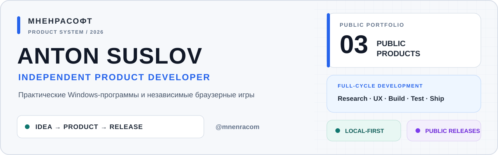
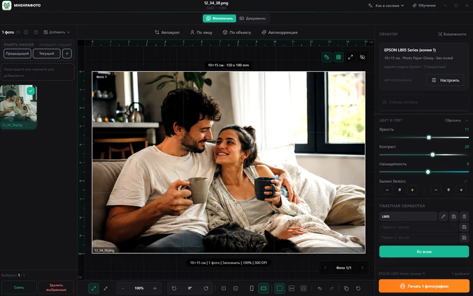
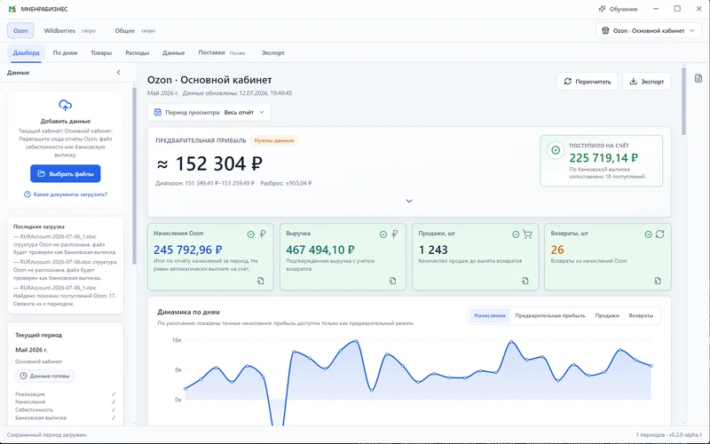
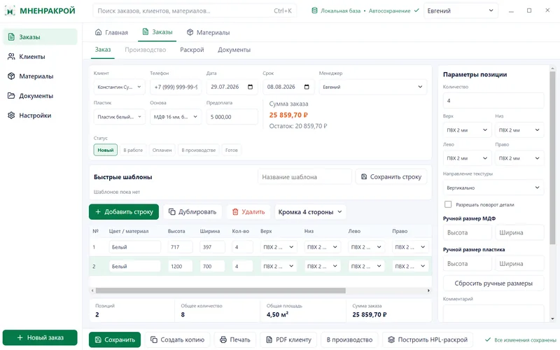

<picture>
  <source media="(prefers-color-scheme: dark)" srcset="assets/profile-dashboard-dark.svg">
  <source media="(prefers-color-scheme: light)" srcset="assets/profile-dashboard-light.svg">
  
</picture>

**Anton Suslov создаёт продукты целиком:** исследует практическую задачу, проектирует пользовательский сценарий и интерфейс, реализует программу, проверяет её на реальных сценариях, готовит документацию, сборку и публичный релиз.

Independent product developer building practical Windows software and browser games.

## Три продукта. Один подход.

<table>
  <tr>
    <td width="50%" valign="top">
      
      <h3>МНЕНРАФОТО</h3>
      
Локальная Windows-программа для быстрой подготовки, обработки и печати фотографий.

      <ul>
        <li>Пакетная обработка, пресеты и печатные раскладки.</li>
        <li>Отдельный режим для фото на документы.</li>
        <li>Локальная работа без загрузки изображений в облако.</li>
      </ul>
      
0.2.0 ALPHA 2 · ПУБЛИЧНОЕ ТЕСТИРОВАНИЕ

      
<a href="https://github.com/mnenracom/mnenrafoto-releases">Репозиторий</a> · <a href="https://github.com/mnenracom/mnenrafoto-releases/releases/tag/v0.2.0-alpha.2">Релиз v0.2.0-alpha.2</a>

    </td>
    <td width="50%" valign="top">
      
      <h3>МНЕНРАБИЗНЕС</h3>
      
Локальная Windows-программа для анализа финансовых отчётов Ozon из Excel.

      <ul>
        <li>Отчёты реализации, начисления, себестоимость и банковская выписка.</li>
        <li>Финансовая панель, динамика, товары и возвраты.</li>
        <li>Локальное хранение периодов и экспорт итогов в Excel.</li>
      </ul>
      
0.2.0 ALPHA 2 · ПУБЛИЧНОЕ ТЕСТИРОВАНИЕ

      
<a href="https://github.com/mnenracom/mnenrabiz-releases">Репозиторий</a> · <a href="https://github.com/mnenracom/mnenrabiz-releases/releases/tag/v0.2.0-alpha.1">Релиз v0.2.0-alpha.1</a>

    </td>
  </tr>
  <tr>
    <td width="50%" valign="middle">
      
    </td>
    <td width="50%" valign="top">
      <h3>МНЕНРАКРОЙ</h3>
      
Локальная Windows-программа для оформления заказов на мебельные фасады, расчёта MDF/HPL, клиентских PDF и HPL-раскроя.

      <ul>
        <li>Заказы, клиенты, материалы, кромки и расчёт деталей.</li>
        <li>Полосовой HPL-раскрой для листовых материалов.</li>
        <li>Клиентские PDF, карты раскроя и резервные копии локальной базы.</li>
      </ul>
      
0.1.0 ALPHA 1 · ЗАКРЫТОЕ/ПУБЛИЧНОЕ ТЕСТИРОВАНИЕ

      
<a href="https://github.com/mnenracom/mnenrakroy-releases">Репозиторий</a> · <a href="https://github.com/mnenracom/mnenrakroy-releases/releases/tag/v0.1.0-alpha.1">Релиз v0.1.0-alpha.1</a>

    </td>
  </tr>
</table>

## Продуктовый цикл

`Задача → Проектирование → Разработка → Проверка → Релиз`

- **Задача** — понять реальный сценарий и его ограничения.
- **Проектирование** — выстроить интерфейс и модель продукта.
- **Разработка** — реализовать рабочую систему.
- **Проверка** — испытать её на настоящих задачах.
- **Релиз** — собрать, описать и выпустить.

## Профессиональный фокус

- Windows-приложения и локальные инструменты для бизнеса.
- Продуктовый UX и реальные пользовательские сценарии.
- Браузерные игры, документация и релизный процесс.

МНЕНРАСОФТ · продукты от идеи до публичного релиза

