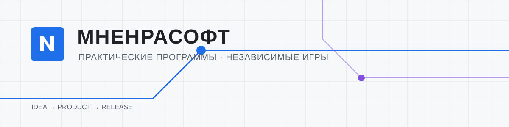

  

# Anton S.

> Независимый разработчик, создающий практичные Windows-программы и браузерные игры под брендом **МНЕНРАСОФТ**.

Independent product developer building practical Windows software and browser games.

Я веду продукт целиком: от исследования задачи и проектирования интерфейса до разработки, тестирования, документации, сборки и публичного релиза. В фокусе — понятные инструменты для реальной работы и продукты, которыми можно пользоваться самостоятельно.

## Избранные продукты

<table>
  <tr>
    <td width="50%" valign="top">
      <h3>МНЕНРАФОТО</h3>
      
Бесплатная Windows-программа для быстрой подготовки и печати фотографий.

      <ul>
        <li>Импортирует файлы и папки; поддерживает JPG, PNG, WebP, HEIC и HEIF.</li>
        <li>Даёт пакетную обработку, пресеты, коррекцию отдельных фотографий и печатные раскладки.</li>
        <li>В Alpha 2 есть режим «Фото на документы», JPEG-экспорт и работа с текущим и предыдущим заказом.</li>
        <li>Обработка выполняется локально: фотографии не отправляются в облако.</li>
      </ul>
      
<strong>Статус:</strong> 0.2.0 Alpha 2, публичное тестирование.

      
<a href="https://github.com/mnenracom/mnenrafoto-releases">Открыть публичный репозиторий →</a>

    </td>
    <td width="50%" valign="top">
      <h3>МНЕНРАБИЗНЕС</h3>
      
Локальная Windows-программа для анализа финансовых отчётов Ozon из Excel.

      <ul>
        <li>Импортирует отчёты реализации и начислений Ozon, базу себестоимости и банковскую выписку.</li>
        <li>Показывает финансовый dashboard, динамику по дням, товары, возвраты и факторы результата.</li>
        <li>Поддерживает кабинеты Ozon, выбор периода, банковскую сверку и Excel-экспорт.</li>
        <li>Исходные Excel не изменяются, а данные не отправляются на сервер.</li>
      </ul>
      
<strong>Статус:</strong> 0.2.0 Alpha 2, публичное тестирование.

      
<a href="https://github.com/mnenracom/mnenrabiz-releases">Открыть публичный репозиторий →</a>

    </td>
  </tr>
</table>

## Как строится работа над продуктом

1. **Задача и контекст** — разбираю практический сценарий и формулирую, что продукт должен помогать сделать.
2. **Проектирование** — выстраиваю пользовательский путь, интерфейс и понятную модель данных.
3. **Разработка и проверка** — реализую, тестирую и уточняю продукт на реальных сценариях.
4. **Релиз и сопровождение** — готовлю документацию, сборку и публичные материалы для использования и обратной связи.

## Публичные ссылки

- [GitHub: @mnenracom](https://github.com/mnenracom)
- [МНЕНРАФОТО — публичные материалы и загрузки](https://github.com/mnenracom/mnenrafoto-releases)
- [МНЕНРАБИЗНЕС — публичные материалы и загрузки](https://github.com/mnenracom/mnenrabiz-releases)

---

МНЕНРАСОФТ · продукты, доведённые до публичного выпуска
